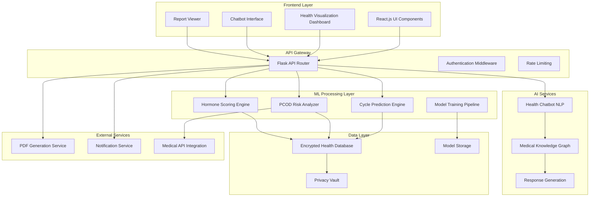

# Design Document: Smart Period Tracking & PCOD Risk Prediction System

## Overview

The Smart Period Tracking & PCOD Risk Prediction System extends an existing women's health application with advanced ML capabilities. The system employs privacy-preserving machine learning, real-time health analytics, and intelligent user guidance while maintaining seamless integration with the current React.js/Flask architecture.

The design prioritizes user privacy through federated learning, provides medically-validated AI insights, and delivers actionable health intelligence through intuitive visualizations and conversational interfaces.

## Architecture

### High-Level Architecture



### Privacy-First ML Architecture

The system implements a three-tier privacy architecture:

1. **Data Minimization Layer**: Collects only essential health metrics
2. **Processing Layer**: Uses federated learning and differential privacy
3. **Storage Layer**: Employs homomorphic encryption and secure enclaves

### Microservices Design

- **Prediction Service**: Handles cycle forecasting and confidence scoring
- **Risk Assessment Service**: Manages PCOD analysis and health scoring
- **Chatbot Service**: Processes natural language queries and generates responses
- **Visualization Service**: Creates interactive charts and health dashboards
- **Report Service**: Generates comprehensive PDF health reports

## Components and Interfaces

### ML Engine Components

#### Cycle Prediction Engine
```python
class CyclePredictionEngine:
    def __init__(self):
        self.ensemble_model = EnsemblePredictor([
            LSTMPredictor(),
            RandomForestPredictor(),
            GaussianProcessPredictor()
        ])
        self.confidence_calculator = ConfidenceEstimator()
    
    def predict_cycles(self, user_data: HealthData, num_cycles: int = 6) -> PredictionResult:
        """Generate cycle predictions with confidence intervals"""
        pass
    
    def update_model(self, new_data: HealthData) -> ModelUpdateResult:
        """Incrementally update predictions with new user data"""
        pass
```

#### PCOD Risk Analyzer
```python
class PCODRiskAnalyzer:
    def __init__(self):
        self.risk_model = GradientBoostingClassifier()
        self.feature_extractor = HealthFeatureExtractor()
        self.medical_validator = MedicalRuleValidator()
    
    def assess_risk(self, health_profile: HealthProfile) -> RiskAssessment:
        """Calculate PCOD risk score with medical validation"""
        pass
    
    def generate_recommendations(self, risk_score: float) -> List[Recommendation]:
        """Provide personalized health recommendations"""
        pass
```

### Health Chatbot System

#### Natural Language Processing Pipeline
```python
class HealthChatbot:
    def __init__(self):
        self.intent_classifier = HealthIntentClassifier()
        self.entity_extractor = MedicalEntityExtractor()
        self.knowledge_graph = MedicalKnowledgeGraph()
        self.response_generator = EvidenceBasedResponseGenerator()
    
    def process_query(self, user_query: str, user_context: UserContext) -> ChatbotResponse:
        """Process health queries with medical validation"""
        pass
    
    def escalate_urgent_concerns(self, query_analysis: QueryAnalysis) -> EscalationResult:
        """Identify and escalate urgent health concerns"""
        pass
```

### Visualization Engine

#### Interactive Health Charts
```javascript
class HealthVisualizationEngine {
    constructor() {
        this.chartLibrary = new D3ChartRenderer();
        this.dataProcessor = new HealthDataProcessor();
        this.interactionHandler = new ChartInteractionHandler();
    }
    
    generateCycleChart(healthData, timeRange) {
        // Create interactive cycle visualization with predictions
    }
    
    generateRiskTrendChart(riskHistory, correlationFactors) {
        // Visualize PCOD risk trends with contributing factors
    }
    
    generateHormoneScoreChart(hormoneData, lifestyle_factors) {
        // Display hormone balance scores with lifestyle correlations
    }
}
```

### Privacy Management System

#### Data Protection Layer
```python
class PrivacyManager:
    def __init__(self):
        self.encryption_service = AESEncryptionService()
        self.anonymizer = DifferentialPrivacyAnonymizer()
        self.federated_learner = FederatedLearningCoordinator()
    
    def encrypt_health_data(self, raw_data: HealthData) -> EncryptedData:
        """Encrypt sensitive health information"""
        pass
    
    def anonymize_for_ml(self, user_data: HealthData) -> AnonymizedData:
        """Apply differential privacy for ML training"""
        pass
    
    def federated_model_update(self, local_gradients: ModelGradients) -> UpdateResult:
        """Update global model without exposing raw data"""
        pass
```

## Data Models

### Core Health Data Structures

#### User Health Profile
```python
@dataclass
class HealthProfile:
    user_id: str
    age: int
    cycle_history: List[CycleRecord]
    symptom_history: List[SymptomRecord]
    lifestyle_factors: LifestyleData
    medical_history: MedicalHistory
    privacy_preferences: PrivacySettings
    
@dataclass
class CycleRecord:
    cycle_id: str
    start_date: datetime
    end_date: Optional[datetime]
    flow_intensity: FlowIntensity
    symptoms: List[Symptom]
    mood_indicators: List[MoodIndicator]
    
@dataclass
class PredictionResult:
    predicted_cycles: List[CyclePrediction]
    confidence_score: float
    accuracy_metrics: AccuracyMetrics
    uncertainty_bounds: ConfidenceInterval
```

#### Risk Assessment Models
```python
@dataclass
class RiskAssessment:
    risk_score: float  # 0-100 scale
    risk_category: RiskCategory  # LOW, MODERATE, HIGH
    contributing_factors: List[RiskFactor]
    recommendations: List[HealthRecommendation]
    confidence_level: float
    assessment_date: datetime
    
@dataclass
class HormoneScore:
    overall_score: float
    component_scores: Dict[str, float]  # mood, energy, cycle_regularity, etc.
    trend_direction: TrendDirection
    lifestyle_correlations: List[LifestyleCorrelation]
```

### ML Model Schemas

#### Training Data Structure
```python
@dataclass
class TrainingDataset:
    features: np.ndarray
    labels: np.ndarray
    user_metadata: List[UserMetadata]
    privacy_budget: float
    data_quality_score: float
    
@dataclass
class ModelMetrics:
    accuracy: float
    precision: float
    recall: float
    f1_score: float
    confidence_calibration: CalibrationMetrics
    fairness_metrics: FairnessMetrics
```

## Correctness Properties

*A property is a characteristic or behavior that should hold true across all valid executions of a system—essentially, a formal statement about what the system should do. Properties serve as the bridge between human-readable specifications and machine-verifiable correctness guarantees.*

### Cycle Prediction Properties

Property 1: Prediction accuracy for sufficient data
*For any* user with at least 3 months of cycle data, generating predictions for 6 future cycles should achieve at least 85% accuracy
**Validates: Requirements 1.1**

Property 2: Incremental learning responsiveness  
*For any* new cycle data entry, the ML engine should update predictions within 24 hours using incremental learning
**Validates: Requirements 1.2**

Property 3: Low confidence notification
*For any* prediction with confidence below 70%, the system should notify the user and request additional data points
**Validates: Requirements 1.3**

Property 4: Irregular cycle handling
*For any* user with irregular cycles, the cycle predictor should provide confidence intervals for each prediction
**Validates: Requirements 1.4**

Property 5: Prediction transparency
*For any* user viewing predictions, the system should display accuracy metrics and confidence levels
**Validates: Requirements 1.5**

### PCOD Risk Assessment Properties

Property 6: Risk score calculation consistency
*For any* user logging symptoms and cycle data, the PCOD analyzer should calculate risk scores using validated medical indicators
**Validates: Requirements 2.1**

Property 7: High risk recommendations
*For any* PCOD risk assessment exceeding 60%, the system should recommend consulting healthcare professionals with specific guidance
**Validates: Requirements 2.2**

Property 8: Comprehensive risk factor processing
*For any* health data including irregular cycles, weight changes, acne patterns, and hormonal symptoms, the PCOD analyzer should process all factors in risk calculation
**Validates: Requirements 2.3**

Property 9: Educational resource provision
*For any* completed risk assessment, the system should provide educational resources about PCOD prevention and management
**Validates: Requirements 2.4**

Property 10: Historical risk trend maintenance
*For any* monthly risk score update, the PCOD analyzer should maintain historical risk trends while incorporating new data
**Validates: Requirements 2.5**

### Visualization Properties

Property 11: Comprehensive chart generation
*For any* health data, the visualization engine should generate interactive charts for cycle length, symptom severity, mood patterns, and weight trends
**Validates: Requirements 3.1**

Property 12: Interactive chart capabilities
*For any* time range selection, the system should display customizable graphs with zoom, filter, and export capabilities
**Validates: Requirements 3.2**

Property 13: Anomaly and correlation detection
*For any* health metrics data, the visualization engine should highlight pattern anomalies and correlations between different metrics
**Validates: Requirements 3.3**

Property 14: Health pattern color coding
*For any* trend display, the system should use color-coded indicators for normal, concerning, and positive health patterns
**Validates: Requirements 3.4**

Property 15: Comparative analysis support
*For any* visualization request, the engine should support comparison views between different time periods and cycle phases
**Validates: Requirements 3.5**

### Privacy and Security Properties

Property 16: Data encryption compliance
*For any* health data storage or transmission, the privacy manager should use AES-256 encryption both at rest and in transit
**Validates: Requirements 4.1**

Property 17: Federated learning privacy preservation
*For any* ML prediction processing, the system should use federated learning techniques to avoid raw data exposure
**Validates: Requirements 4.2**

Property 18: Anonymization accuracy balance
*For any* analytics processing, the privacy manager should implement data anonymization while preserving prediction accuracy
**Validates: Requirements 4.3**

Property 19: Data deletion compliance
*For any* user data deletion request, the system should permanently remove all associated data within 30 days
**Validates: Requirements 4.4**

Property 20: Data export completeness
*For any* user data export request, the privacy manager should provide complete data export capabilities and transparency reports
**Validates: Requirements 4.5**

### Chatbot Properties

Property 21: Response time and validation
*For any* health query, the health chatbot should respond using medically-validated information sources within 3 seconds
**Validates: Requirements 5.1**

Property 22: Symptom guidance appropriateness
*For any* symptom-related query, the health chatbot should provide educational information while recommending professional medical advice for serious concerns
**Validates: Requirements 5.2**

Property 23: Response personalization
*For any* health query, the health chatbot should personalize responses based on user's cycle phase, age, and historical health patterns
**Validates: Requirements 5.3**

Property 24: Emergency escalation
*For any* urgent health concern query, the health chatbot should escalate to emergency resources and healthcare provider recommendations
**Validates: Requirements 5.5**

### Hormone Scoring Properties

Property 25: Hormone score calculation consistency
*For any* daily health data, the hormone scorer should calculate balance scores using cycle regularity, symptom severity, and mood indicators
**Validates: Requirements 6.1**

Property 26: Imbalance response recommendations
*For any* hormone score indicating imbalance, the system should provide lifestyle recommendations and tracking suggestions
**Validates: Requirements 6.2**

Property 27: Hormone report generation
*For any* weekly or monthly period, the hormone scorer should generate health reports with trend analysis
**Validates: Requirements 6.3**

Property 28: Significant change notifications
*For any* significant hormone score improvement or decline, the system should notify users with actionable insights and recommendations
**Validates: Requirements 6.4**

Property 29: External factor correlation
*For any* hormone score calculation, the scorer should correlate scores with external factors like stress, sleep, and exercise patterns
**Validates: Requirements 6.5**

### Report Generation Properties

Property 30: Comprehensive report content
*For any* PDF report generation request, the report generator should include cycle history, predictions, risk assessments, and visualizations
**Validates: Requirements 7.1**

Property 31: Report customization capabilities
*For any* report generation request, the system should allow customization of date ranges, included metrics, and privacy levels
**Validates: Requirements 7.2**

Property 32: Medical professional formatting
*For any* generated report, the report generator should format for medical professionals with standardized health terminology and clear data presentation
**Validates: Requirements 7.3**

Property 33: Report generation performance
*For any* report request, the system should generate reports within 60 seconds and provide secure download links
**Validates: Requirements 7.4**

Property 34: Report guidance inclusion
*For any* generated report, the report generator should include data interpretation guides and recommendations for healthcare discussions
**Validates: Requirements 7.5**

### System Integration Properties

Property 35: API integration compatibility
*For any* existing Flask API functionality, the ML engine integration should not disrupt current system operations
**Validates: Requirements 8.1**

Property 36: Real-time feature performance
*For any* prediction processing request, the system should maintain response times under 2 seconds for real-time features
**Validates: Requirements 8.2**

Property 37: Frontend and internationalization compatibility
*For any* React.js component or language selection, the system should support existing frontend components and 12-language internationalization
**Validates: Requirements 8.3**

Property 38: ML pipeline automation
*For any* model retraining trigger, the ML engine should implement automated retraining pipelines with A/B testing for continuous improvement
**Validates: Requirements 8.5**

## Error Handling

### ML Model Error Management

**Prediction Failures**: When cycle prediction models fail or produce unreliable results, the system gracefully degrades to statistical averages while notifying users of reduced accuracy.

**Risk Assessment Errors**: PCOD risk analysis failures trigger fallback to rule-based assessment methods and recommend immediate healthcare consultation for safety.

**Data Quality Issues**: Poor quality or insufficient data triggers user guidance for better data collection and adjusts confidence levels accordingly.

### Privacy and Security Error Handling

**Encryption Failures**: Any encryption/decryption errors immediately halt data processing and trigger security incident protocols.

**Federated Learning Errors**: Model update failures maintain previous model versions and log incidents for investigation without exposing user data.

**Data Breach Detection**: Automated monitoring detects potential breaches and triggers immediate data protection protocols and user notifications.

### User Interface Error Management

**Chatbot Failures**: When the AI chatbot cannot process queries, it gracefully hands off to predefined FAQ responses and escalation pathways.

**Visualization Errors**: Chart generation failures provide alternative data views and export options to ensure users retain access to their health information.

**Report Generation Failures**: PDF generation errors offer alternative formats (JSON, CSV) and retry mechanisms with user notification.

### System Integration Error Handling

**API Timeout Management**: Long-running ML operations implement proper timeout handling with progress indicators and cancellation options.

**Database Connection Failures**: Robust connection pooling and retry logic ensure data persistence reliability with user feedback on system status.

**External Service Dependencies**: Medical API failures trigger cached response mechanisms and clear user notifications about reduced functionality.

## Testing Strategy

### Dual Testing Approach

The system employs both unit testing and property-based testing for comprehensive coverage:

**Unit Tests**: Focus on specific examples, edge cases, and integration points between components. These validate concrete scenarios like specific PCOD risk calculations, chatbot response formatting, and report generation with known data sets.

**Property Tests**: Verify universal properties across all inputs through randomized testing. These ensure correctness properties hold for any valid user data, prediction scenarios, and system interactions.

### Property-Based Testing Configuration

- **Testing Library**: Hypothesis (Python) for backend ML services, fast-check (JavaScript) for frontend components
- **Test Iterations**: Minimum 100 iterations per property test to ensure statistical confidence
- **Test Tagging**: Each property test references its design document property with format:
  - **Feature: smart-period-tracking, Property {number}: {property_text}**

### ML Model Testing Strategy

**Model Validation**: Property tests verify prediction accuracy, bias detection, and fairness metrics across diverse user populations and health patterns.

**Privacy Testing**: Specialized tests validate federated learning implementation, encryption correctness, and data anonymization effectiveness.

**Performance Testing**: Load testing ensures system scalability under concurrent user loads while maintaining prediction accuracy and response times.

### Integration Testing Approach

**API Integration**: Tests verify seamless integration with existing Flask endpoints and React components without functionality disruption.

**Cross-Component Testing**: Validates data flow between ML engines, visualization components, and report generation systems.

**End-to-End Health Workflows**: Tests complete user journeys from data input through prediction generation to report export, ensuring system coherence.

### Medical Validation Testing

**Clinical Accuracy**: Tests validate chatbot responses against medical literature and ensure appropriate escalation for serious health concerns.

**Risk Assessment Validation**: Property tests verify PCOD risk calculations against established medical criteria and research findings.

**Regulatory Compliance**: Tests ensure privacy handling, data retention, and medical guidance meet healthcare regulatory requirements.